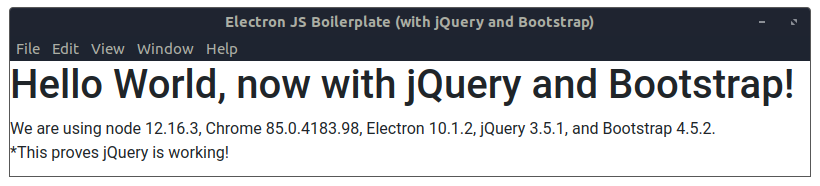

# Electron JS with jQuery and Bootstrap

A quickstart boilerplate for [Electron](https://www.electronjs.org/) application development with [jQuery](https://jquery.com/) and [Bootstrap](https://getbootstrap.com/).

Integrating [jQuery](https://jquery.com/) and [Bootstrap](https://getbootstrap.com/) with [Electron](https://www.electronjs.org/) requires a basic understanding of [Electron's Architecture](https://www.electronjs.org/docs/tutorial/application-architecture) which is based on a single _main_ and one or more _renderer_ processes. Typically, [jQuery](https://jquery.com/) and [Bootstrap](https://getbootstrap.com/) and needed in the _renderer_ processes which means they can't simply be added to the `main.js` script. The additions in both `index.html` and `renderer.js` are what make this integration possible.



### Getting Started

#### Installation

This Electron JS boilerplate requires `node` and `npm` to be installed for use with Electron, as decribed in the [Developer Environment](https://www.electronjs.org/docs/tutorial/development-environment) section of the [Electron Documentation](https://www.electronjs.org/docs).


```sh
# This command should print the version of Node.js
node -v

# This command should print the version of npm
npm -v

# Install the package dependencies
npm install .
```

#### Run the App

Once the dependencies are installed, this Electron app uses the standard `start` command with `npm`.

```sh
npm start .
```

### Acknowledgments

* This boilerplate app is based on the example Electron App from [Writing Your First Electron App](https://www.electronjs.org/docs/tutorial/first-app) in the [Electron Documentation](https://www.electronjs.org/docs). Also available on [Github](https://github.com/electron/electron-quick-start).
* jQuery and Bootstrap integration are adapted from ["How to include and use jQuery in Electron Framework"](https://ourcodeworld.com/articles/read/202/how-to-include-and-use-jquery-in-electron-framework) from [Our Code World](https://ourcodeworld.com/) and ["Electron - How to add jQuery and Bootstrap to your project"](https://www.ryadel.com/en/electron-jquery-bootstrap-project-add-npm/) from Ryan @ [Ryadel](https://www.ryadel.com/en/).